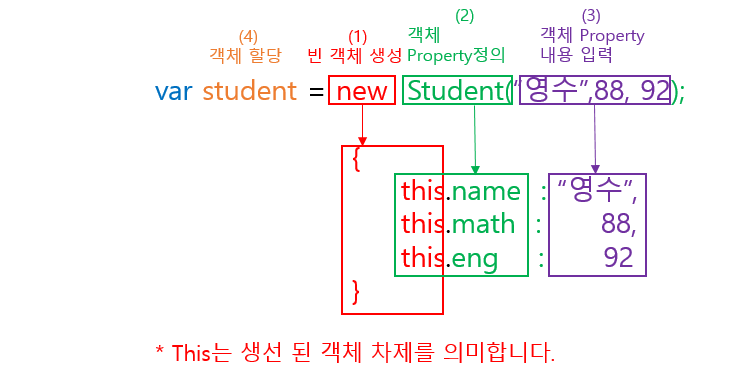

 # 브라우저의 렌더링 과정에 대해서 상세하게 설명해달라 


## callbyValue && callByrefenrence

call by Value 변수가 담고있는 값이 복사되고
callByReference는 주소가 전달되는 것입니다.

````js
let x = 5
function CBV(param){
  param = 3;

}
CBV(x); /// 
console.log(x) /// 5 


let x = {a:1, b:2 , c:3}
function CBR(param){
  param.a = 2;

}
CBR(x); /// 
console.log(x) /// {a:2 , b:2 , c:3}
````

# Http와 Https 통신 방식의 차이?


결정적 차이는 보안이다.
 1. http방식은 네트워크상에서 정보를 누군가가 마음대로 열람, 수정이 가 / https는 누가 볼수없도록 막음.
 2. http방식이 https방식보다 빠르다. 
 3. Http방식은 민감한정보를 다룰 때 항상 변조, 해킹 가능성을 생각해야한다.
  Https는 설치 및 인증서를 유지하는데 추가적인 비용이 발생. -> 따라서, 민감한 정보가 있는 페이지의 경우 Https 그럴필요가없으면 http로 만들면 된다.


# 호이스팅에 대해 설명해주세요.

함수 안에 있는 선언들을 모두 끌어올려서 해당 함수 유효 범위의 최상단에 선언하는 것을 말합니다.
호이스팅에는 함수 호이스팅과 변수 호이스팅이 있는데, 변수 호이스팅의 경우 각 변수 선언 키워드 마다 차이가 있습니다.

함수 호이스팅의 경우에는 함수 선언식을 통해 작성한 함수는 해당 함수의 내부 블럭까지 호이스팅되기 때문에 어디서든지 사용할 수 있으나, 함수 표현식의 경우에는 변수 호이스팅과 동일하게 동작하기 때문에 이 점을 유의하여 코드를 작성해야합니다.


# 클로저는 무엇인가요? 원리와 사용하는 이유를 설명해주세요.

 클로저는 반환된 내부함수가 자신이 선언됐을 때의 환경(Lexical environment)인 스코프를 기억하여 자신이 선언됐을 때의 환경(스코프) 밖에서 호출되어도 그 환경(스코프)에 접근할 수 있는 함수입니다.


 외부 lexical 환경을 기억하고 접근할수있는 함수

외부 lexical을 참조하고있는거 
자기cope내부변수를 저장하는 환경레코드 .
구현 

````js
function f() {
  let value = 123;

  return function() {
    alert(value);
  }
}

let g = f(); // g가 살아있는 동안엔 연관 렉시컬 환경도 메모리에 살아있습니다.

````

# this 용법을 아는대로 설명해주세요.

this는 '자신이 속한 객체 또는 자신이 생성할 인스턴스를 가리키는 자기 참조 변수' 입니다.

this는 함수의 호출 방식에 따라 특정 객체를 바인딩하게됩니다.

생성자 함수 내부에서 this는 생성자 함수가 생성할 인스턴스와 바인딩됩니다.
Call, Apply, Bind 메소드 사용 시, 함수의 첫 번째 인수로 전달하는 객체에 바인딩됩니다.
Object.method 형태와 같이 객체 내에서 호출할 경우, this는 해당 객체와 바인딩됩니다.
위 세 가지를 제외한 일반적인 함수 호출의 경우, this는 전역 객체와 바인딩됩니다.
마지막으로 ES6의 화살표 함수 내에서 this가 사용될 경우, this는 상위 스코프의 this와 바인딩됩니다.

## TMI
### function 문맥은 전역값을 가르칸다.
### 함수를 어떤 객체의 메서드로 호출하면 this의 값은 그 객체를 사용한다.

### 함수를 new키워드와 함께 생성자로 사용하면 this는 새로 생긴 객체에 묶인다.
````js
function C() {
  this.a = 37;
}

var o = new C();
console.log(o.a); // 37


function C2() {
  this.a = 37;
  return {a: 38};
}

o = new C2();
console.log(o.a); // 38
````


# 이벤트 버블링에 대해서 말씀해주세요.

이벤트 버블링은 특정 화면 요소에서 이벤트가 발생했을 때, 해당 이벤트가 더 상위의 화면 요소들로 전달되어가는 특성을 의미합니다.
이벤트 버블링은 이벤트 위임의 동작 메커니즘이라고 볼 수 있습니다.

# OOP을 설명해주세요.

OOP란 Object Oriented Programming, 즉 객체지향프로그래밍을 말합니다.
객체지향프로그래밍이란 객체들이 유기적으로 동작하는 프로그래밍 이론을 말하며,
객체지향프로그래밍을 하는 주요 장점으로는 코드 재사용 및 중복 제거등이 있습니다.

그 외에도 OOP는 4가지 특성이 있는데

첫 번째는 다형성, 선언되어있는 하나의 메소드를 오버라이딩하여 여러가지의 기능으로 동작시킬 수 있는 것.
두 번째는 캡슐화, 데이터와 데이터 구조를 묶음으로써 외부에 데이터를 노출시키지않는 데이터 은닉화가 가능하다는 것.
세 번째는 상속, 상속관계에 있는 두 클래스에서 자식 클래스가 부모 클래스의 메소드를 상속받아 사용함으로써 코드의 재사용이 가능하는 것.
마지막으로 추상화, 클래스에 대해 공통 속성이나 기능을 묶어 이름을 붙여서 객체지향관점으로 봤을 때 추상화가 가능하다는 점 입니다.

### Promise와 Callback의 차이점은 무엇이며 각각의 장단점에 대해서 설명해주세요.

둘 다 자바스크립트에서 비동기처리를 위해 사용되는 패턴입니다.
Callback 같은 경우 함수의 처리 순서를 보장하기 위해서 함수를 중첩되게 사용하는 경우가 발생해 콜백지옥이 발생한다는 단점과 에러 처리가 힘들다는 단점이 있습니다.

이러한 단점을 해결하기 위해 Promise가 ES6에서부터 정식 채택되어 사용되어지고 있다.


### Async, Await가 무엇이며, Promise와의 차이점을 설명해주세요.


Promise를 더욱 쉽게 사용할 수 있도록 하는 ES8 문법입니다.
함수의 앞부분에 async 키워드를 추가하고 함수 내부에서 Promise의 앞부분에 await 키워드를 사용하면 됩니다.

async, await을 사용할 경우 Promsise ... then보다 코드가 간결해지며 에러 핸들링의 경우에는 try...catch를 사용해야합니다.
async가 사용된 함수는 promise를 반환하기 때문에 사용 시 유의해야합니다


# 프로그래밍 🔥

## 프로그래밍이란 뭐라고 생각하나요?
## 컴파일러는 뭐고 인터프리터는 뭔가요?
## 자바스크립트란 🔥

## 자바스크립트의 특징은 뭐가 있나요?

1. 자바스크립트는 객체 기반의 스크립트 언어입니다.

2. 자바스크립트는 동적이며, 타입을 명시할 필요가 없는 인터프리터 언어입니다.

3. 자바스크립트는 객체 지향형 프로그래밍과 함수형 프로그래밍을 모두 표현할 수 있습니다.


# 변수 🔥

## 변수란 무엇인가요?
  자바스크립트에서 변수란 값을 저장하기 위해 확보한 메모리 공간 자체 또는 메모리 공간을 식별하기 위한 식별자입니다.
## 식별자란 무엇인가요? 🔥
식별자는 자바스크립트에서 이름을 붙일 때 사용하는 단어이다. 식별자의 예로는 변수명과 함수명이 있다.
규칙 
키워드를 사용하면 안 된다. ??
숫자로 시작하면 안 된다.
특수 문자는 _와 $만 허용된다.
공백 문자를 포함할 수 없다.


## 변수를 선언한다는 것은 어떤 것을 의미하나요?
변수명 선언 또는 변수 선언은 변수의 이름을 지정하는 의미입니다. 즉 저장 공간의 이름을 지정하는 작업입니다.
변수는 힙에 쌓인다.

## var 키워드는 뭔가요?
 자바스크립트 변수 서언 방식인 하나로 
 함수의 재할당 재선언이 가능합니다.
## 호이스팅이 뭔가요? 🔥🔥🔥🔥
  호이스팅(Hoisting)이란, var 선언문이나 function 선언문 등을 해당 스코프의 선두로 옮긴 것처럼 동작하는 특성을 말한다.

자바스크립트는 ES6에서 도입된 let, const를 포함하여 모든 선언(var, let, const, function, function*, class)을 호이스팅한다.

하지만, var 로 선언된 변수와는 달리 let 로 선언된 변수를 선언문 이전에 참조하면 참조 에러(ReferenceError)가 발생한다.
````js
	console.log(foo); // undefined
	var foo;

	console.log(bar); // Error: Uncaught ReferenceError: bar is not defined
	let bar;
````


이는 let 로 선언된 변수는 스코프의 시작에서 변수의 선언까지 일시적 사각지대(Temporal Dead Zone; TDZ)에 빠지기 때문이다.

## var 키워드의 문제점은 무엇이 있나요? 🔥🔥
변수를 한 번 더 선언했음에도 불구하고, 에러가 나오지 않고 각기 다른 값이 출력되는 것을 볼 수 있다.

이는 유연한 변수 선언으로 간단한 테스트에는 편리 할 수 있겠으나, 코드량이 많아 진다면 어디에서 어떻게 사용 될지도 파악하기 힘들뿐더러 값이 바뀔 우려가 있다.

## let 키워드는 var 키워드와 어떤 점이 다른가요? 🔥🔥🔥

 자바스크립트 변수 서언 방식인 하나로 
 함수의 재할당이 가능하지만 재선언이 불 가능합니다.

## TDZ 🔥🔥🔥
let 이나 const 는 변수를 선언중에 tdz hoisting 으로 변수를 최당단에 선언하지만 tdz를 할당해서 에러를 만듬.


## const 키워드는 어떤 특징이 있나요? 🔥🔥
  자바스크립트 변수 서언 방식인 하나로 
   함수의 재할당 재선언이 불 가능합니다.

## 식별자 네이밍 규칙은 어떤 것들이 있나요?
  식별자는 특수문자를 제외한 문자,숫자,언더스코어(_),달러 기호($)를 포함할 수 있다.
  식별자는 특수문자를 제외한 문자,언더스코어,달러 기호로 시작해야한다. 숫자로 시작하는것은 허용하지 않는다.
  예약어는 식별자로 사용할 수 없다.
## 네이밍 컨벤션은 어떤 것들이 있나요? //모르는것 다시한번 검색해보기!
   1. Lower Camel Case

    단봉 낙타 표기법
    보통 camelcase라고 하면 lower camel case를 의미
    각 단어의 첫 문자를 대문자로 표시 ( 단, 이름의 제일 첫 문자는 소문자 )
    

    2. Upper Camel Case

    쌍봉 낙타 표기법
    

    (1) Pascal Case

    전체 이름의 첫 문자를 포함한 각 단어의 첫 문자를 대문자로 표시
    

    (2) Hungarian Notation

    이름 앞에 변수 타입을 접두어로 넣어주는 표기법
    접두어 종류로는 ch : char / db : double / str : string / b : boolean 등이 있다.
    

    3) Snake_Case

    각 단어의 사이를 언더바 ( _ )로 구분하는 표기법


## 리터럴이 뭔가요?
  리터럴은 사람이 이해할 수 있는 문자 또는 약속된 기호를 사용해 값을 생성하는 표기법을 말한다.

  자바스크립트 엔진은 코드가 실행되는 시점인 런타임에 리터럴을 평가해 값을 생성한다.
  즉, 리터럴은 값을 생성하기 위해 미리 약속한 표기법이라고 할 수 있다.
# 데이터 타입 🔥


## 데이터 타입의 종류는 어떤 것들이 있나요? 🔥
기본형 타입에는 숫자, 문자열, boolean, null, undefined이 있고 ES6에서 Symbol이 추가되었다.
숫자 - 숫자형 자료형은 배정밀도 64비트 부동 수점 형식의 2진수로 저장되어 숫자형타입 단 하나만 존재한다.
-따라서 모든 수를 실수로 처리하며, 정수 표현하기 위한 데이터타입이 별도로 존재하지 않는다. 따라서 정수로 표시된다해도 사실은 실수라는 것을 의미한다.
-false 꺼져있다는 뜻으로 값으로 0, null, undefined, NaN, '' 모두 간주된다.

참조형 데이터 타입(Reference Data Type/ Object Data Type)의 종류
참조형 데이터에는 **객체(object)**가 있고 객체의 하위 부류로 배열(Array), 함수(Function), 날짜(Date), 정규표현식(RegExp), ES6에서 추가된 Set, WeekSet, Map, WeekMat 등이 있습니다. 

## 심벌 타입은 뭐죠?  🔥 🔥
 심벌 값은 다른 값과 중복되지 않은 유일무이한 값이다.
-symbol은 이름이 충돌할 위험이 없는 객체의 유일한 프로퍼티 키(고유한 식별자)를 만들거나 우선 순위를 주고 싶을 때 사용한다.

-심벌 이외의 원시 값은 리터럴을 통해 생성하지만 심벌은 Symbol함수를 호출해 생성한다. 생성된 심벌 값은 외부에 노출되지 않고 다른 값과 중복되지 않는 유일무이한 값이다.
## 데이터 타입은 왜 필요할까요? 🔥
## 정적 타이핑이 뭔가요?
자료형(type)을 컴파일 당시에 결정하는 것으로, 변수에 들어갈 값의 형태에 따라 자료형을 사전에 지정해야한다. 컴파일 진행 시 자료형에 맞지 않은 값이 전달되면 컴파일 에러를 발생시킨다. 대표적인 언어로 C, Java, C++, C# 등이 있다. 컴파일 당시에 자료형에 대한 판단을 진행하기 때문에 속도가 빠르며, 타입 에러로 발생하는 문제점을 초기에 발견할 수 있는 장점이 있다.


## 동적 타이핑이 뭔가요?
자료형(type)을 컴파일 당시에 결정하는 것으로, 변수에 들어갈 값의 형태에 따라 자료형을 사전에 지정해야한다. 컴파일 진행 시 자료형에 맞지 않은 값이 전달되면 컴파일 에러를 발생시킨다. 대표적인 언어로 C, Java, C++, C# 등이 있다. 컴파일 당시에 자료형에 대한 판단을 진행하기 때문에 속도가 빠르며, 타입 에러로 발생하는 문제점을 초기에 발견할 수 있는 장점이 있다.

정적 타이핑과 달리 자료형을 컴파일이 아닌 런타임 시 결정하는 것으로, 자료형의 명시 없이 변수명만 가지로 선언 및 값을 전달하는 것이 가능하다. 대표적인 언어로 Python, Ruby, Javascript 등이 있다. 런타임 당시에 타입에 대한 결정을 진행하므로 프로그래밍 하는 입장에서 편할 수 있지만, 한 편으로는 런타임 동안 예상치 못한 에러가 발생할 수 있고 이를 발견하는데 큰 어려움을 겪을 수 있다.

## 타입변환과 단축 평가 🔥

## 명시적 타입 변환이 뭔가요?
자바스크립트에서 값의 타입은 상황 따라 다른 타입으로 변환할 수 있다.
## 명시적 타입 변환 함수를 예를 들어볼 수 있나요?
Number( ) : 문자를 숫자로 변환한다.
String( ) : 숫자나, 불린 등을 문자형으로 변환한다.
Boolean( ) : 문자나 숫자 등을 불린형으로 변환한다.    // 값이 0 이면 true, 1 이면 false 
Object( ) : 모든 자료형을 객체형으로 변환한다    // 하위에 값을 줄 수 있게 된다.
parseInt( ) : 문자를 int형으로 변환한다. (정수)    // 소수점 아래 숫자를 자른다.
parseFloat( ) : 문자를 float형으로 변환한다. (소수)    // 소수점 아래 숫자까지 살려준다.
## 암묵적 타입 변환이 뭔가요?
자바스크립트에서는 특정 타입의 값을 기대하는 곳에 다른 타입의 값이 오면, 자동으로 타입을 변환해서 사용한다.
const a = "10";
const b = "20";
const result = a + b;
console.log(result);    // 1020

result = a - b;
console.log(result);    // -10

result = a * b;
console.log(result);	// 200

const c = "문자";
result = c - a;		// NaN
## truthy / falsy 한 값이 뭔가요?
참 같은 값(Truthy)인 값이란 불리언을 기대하는 문맥에서 true로 평가되는 값입니다. 따로 거짓 같은 값으로 정의된 값이 아니면 모두 참 같은 값으로 평가됩니다

falsy 
0
NaN
false
null
undefined
‘’
truthy 
그외의 값들 
# 배열 🔥

## 자바스크립트의 배열은 자료구조의 배열과 같나요?

결론부터 말하자면, 자바스크립트의 배열은 배열이 아닌 객체이다. 더 정확하게는 일반적인 배열의 동작을 흉내 낸 특수한 객체이다.

자바스크립트에서 배열은 요소를 위한 각각의 메모리 공간은 동일한 크기를 갖지 않아도 되며, 연속적으로 이어져 있지 않을 수도 있다. 이러한 배열을 희소 배열(sparse array)라고 한다.


일반 객체와 배열을 구분하는 가장 명확한 차이는 값의 순서와 length 프로퍼티이다.

아래의 코드를 보자.

`````js
console.log(Object.getOwnPropertyDescriptors([1, 2, 3]));
/*
{
  '0': { value: 1, writable: true, enumerable: true, configurable: true },
  '1': { value: 2, writable: true, enumerable: true, configurable: true },
  '2': { value: 3, writable: true, enumerable: true, configurable: true },
  length: { value: 3, writable: true, enumerable: false, configurable: false }
}
*/
````
위의 코드의 결과처럼 자바스크립트 배열은 인덱스를 나타내는 문자열을 프로퍼티 key로 가지며, length 프로퍼티를 갖는 특수한 객체다.


일반적인 배열
인덱스로 요소에 빠르게 접근 가능
특정 요소를 검색하거나 삽입 또는 삭제의 경우 효율적이지 않음
자바스크립트의 배열
해시 테이블로 구현된 객체이므로 인덱스로 요소에 접근하는 경우 일반적인 배열보다 성능적으로 느림
특정 요소를 검색하거나 삽입 또는 삭제하는 경우에는 일반적인 배열보다 성능적으로 빠름


## 배열의 메서드는 어떤 종류가 있나요?
#### pop
배열 뒷부분의 값을 삭제

#### push
 배열 뒷부분에 값을 삽입

#### unshift
배열 앞부분에 값을 삽입

#### shift
배열 앞부분의 값을 삭제
slice( startIndex, endIndex) 배열의 startIndex부터 endIndex까지(endIndex는 불포함)에 대한 shallow copy를 새로운 배열 객체로 반환

#### concat
다수의 배열을 합치고 병합된 배열의 사본을 반환

#### every
배열의 모든 요소가 제공한 함수로 구현된 테스트를 통과하는지를 테스트

#### some
지정된 함수의 결과가 true일 때까지 배열의 각 원소를 반복

#### forEach
배열의 각 원소별로 지정된 함수를 실행한다.

#### map
배열의 각 원소별로 지정된 함수를 실행한 결과로 구성된 새로운 배열을 반환한다.

#### filter
지정된 함수의 결과 값을 true로 만드는 원소들로만 구성된 별도의 배열을 반환한다.

#### reduce
누산기(accumulator) 및 배열의 각 값(좌에서 우로)에 대해 (누산된) 한 값으로 줄도록 함수를 적용

#### reverse
배열의 원소 순서를 거꾸로 바꾼다

## 고차 함수에 대해서 아나요?
고차 함수는 함수를 인자로 받거나 또는 함수를 반환함으로써 작동 하는 함수를 말합니다. 간단히 말하자면, 고차 함수는 함수를 인자로 받거나 함수를 출력(output)으로 반환하는(return) 함수를 말합니다.

예를 들면, Array.prototype.map, Array.prototype.filter 그리고 Array.prototype.reduce가 언어 내부에 포함된 (built-in) 고차함수입니다.

## forEach 메서드와 map메서드의 차이점에 대해 알고 있나요?
map은 새로운 배열을 반환하지만 foreach 는 그렇지 않습니다.

# 객체 리터럴 🔥

## 자바스크립트에서 객체란 뭘까요?
객체는 변수이다. 그러나 객체에는 많은 값이 포함될 수 있다.
(자바스크립트 변수처럼 단일 값을 포함 할 수 있다.)
객체는 중괄호 표기를 이용하여 만들 수 있다.
객체는 각각의 key/value에 대한 정보를 나열할 수 있다.
Key는 문자열 또는 기호여야 한다.
Value는 모든 유형이 될 수 있다.
객체는 한 쌍의 key/value 뒤에 쉼표를 이용하여 그 뒤에 오는 key/value와 구분해주어야 한다.
객체에서 명명된 값을 Properties라고 한다.
변수는 예약어의 이름을 가질 수 없지만 객체는 어떠한 이름이어도 상관없다.
객체 변수를 복사하면 참조가 복사되고 객체가 복제되지 않는다.

## 함수와 메서드의 차이점에 대해 알고 계신가요?
자바스크립트에서 객체를 생성하는 방법은 어떤 것들이 있나요?
원시 값과 객체 비교 🔥

동적 타이핑을 지원하는 자바스크립트에서 데이터의 타입을 크게 2개로 나누는 이유가 있을까요?
값에 의한 전달이 뭔가요?
참조에 의한 전달이 뭔가요?

# 함수 🔥

자바스크립트에서 함수를 정의하는 방법은 몇가지가 있나요?
함수 선언문과 함수 표현식은 어떤 차이가 있나요?
즉시 실행 함수(IIFE)에 대해 알고 있나요? 알고 있다면 아는 내용에 대해 말해보세요
# 스코프 🔥

## 스코프가 뭔가요? 🔥🔥🔥

스코프의 정의는 “식별자 접근 규칙에 따른 유효 범위”이다.
식별자(변수, 함수, 클래스)에 접근할 수 있는 범위가 존재한다.
범위는 중괄호(블록) 또는 함수에 의해 나눠진다.
그 범위를 스코프라고 부른다.
그래서 각각을 Block Scope와 Function Scope라고 부른다.


## 스코프에는 어떤 종류가 있죠? 🔥🔥
 가장 바깥쪽의 스코프를 전역 스코프(Global Scope)라고 부른다.
전역이 아닌 다른 스코프는 전부 지역 스코프(Local Scope)이다.

## 렉시컬 스코프를 아나요? 안다면 렉시컬 스코프는 무엇을 의미하나요? 🔥
전역 변수로 변수를 선언하면 생기는 문제점은 무엇이 있을까요?


# 생성자 함수에 의한 객체 생성 🔥

## 생성자 함수가 뭔가요?
 "객체"를 생성할 때 사용하는 함수 입니다.
 동일한 프로퍼티 객체를 생성하거나 메모리절감을 위해서 사용됩니다.
 생성자 함수의 형태는 
  생성자 명 : 대문자로 시작 (일반 함수와 구별을 하기 위한 관례 입니다)

## 객체 리터럴로 만들 때와는 무슨 차이가 있죠? 왜 생성자 함수를 사용하나요?

객체 리터럴 방식으로 생성된 객체는 같은 형태의 객체를 재생성할 수 없는 반면 생성자 함수를 사용해서 객체를 생성한다면, 생성자 함수를 호출할 때 다른 인자를 넘김으로써 같은 형태의 서로 다른 객체를 생성할 수 있습니다.
## 생성자 함수가 객체(인스턴스)를 생성하는 과정에 대해 간략하게 설명해줄 수 있나요?


1. new 키워드는 빈 객체 {}를 생성 합니다. 
2. 생성자 함수는 빈 객체에 생성 할 프로퍼티를 정의 합니다
3. 함수의 인수들을 프로퍼티에 할당 합니다.
4. 생성된 Student 객체를 student에 할당 합니다

# 함수와 일급 객체 🔥

## 일급 객체가 뭔가요?
특정 언어의 일급 객체란, 컴퓨터 프로그래밍 언어에서 일반적으로 다른 객체들에 적용 가능한 연산을 모두 지원하는 객체를 가리킨다.
다음과 같은 조건을 만족할 때 일급 객체라고 말할 수 있다.

변수(variable)에 담을 수 있다.

// 변수에 함수 할당
var bar = fucntion() { return 'javscript'; };
console.log(bar()); // javascript


파라미터(parameter)로 전달 할 수 있다.

var test = function(func) {
   func(); // 파라미터로 받은 함수 호출
}

// test() 함수에 다른 함수를 파라미터로 넣어 호출
test(function() {
   console.log('javascript');
});


반환값(return value)으로 사용할 수 있다.

// 함수를 리턴하는 test() 함수
function test() {
   return function() {
       console.log('javscript');
   }
}

var bar = test();
bar();


## 자바스크립트에서 함수가 일급 객체라면, 일급 객체로 뭘 할 수 있나요?

콜백 패턴 을 사용할 수 있다.
고차함수(High-order function) 를 만들 수 있다.
Javascript의 클로저(closure) 를 사용해커링(currying) 과 메모이제이션(memoization) 이 가능하다.


## 꼬리 질문) 함수형 프로그래밍이 뭔가요? 🔥🔥 ??
  순수함수
  작성한 함수가 하나 이상의 인자를 받아야 한다.
  
  반환값이 반드시 존재해야 한다.
  함수 내에서 인자를 제외한 다른 변수는 사용하면 안 된다.
  동일 입력, 동일 출력이 보장된다.
  평가 시점이 중요하지 않다.
## 꼬리 질문) 순수 함수가 뭔가요? 일반 함수와는 어떤 차이가 있죠? 🔥🔥
  순수함수
  동일한 입력에 대해 항상 동일한 출력을 반환하는 함수
  외부의 상태를 변경하거나 영향을 받지 않는 함수
  일반함수는 그렇지않습니다. 

# 프로토타입 🔥

 ##  객체지향 프로그래밍은 무엇을 의미하나요? 🔥
  어떤 개념에 대한 자료형과 함수를 '객체' 형태로 함께 묶어서 관리하기 위해 객체지향 프로그래밍 패러다임이 등장하게 되었다. 핵심 포인트는 객체 내부에 자료형 필드와 함수가 함께 존재하는 것이다. 가능한 모든 물리적, 논리적 요소를 객체로 만드는 것이 객체지향 프로그래밍이다.
 ##  객체지향 프로그래밍의 특징에 대해 말해볼 수 있나요? 🔥
  캡슐화 (Encapsulation)
  데이터와 기능을 하나의 단위로 묶는 것을 말합니다.
  데이터를 은닉(Hiding)을 할 수 있습니다.
  - 은닉(Hiding) : 내부 데이터나 내부 구현이 외부로 노출되지 않도록 만드는 것
  하나의 단위로 묶음으로써 (클래스 간의 독립적인 디자인을 함으로써) 약한 결합력(Weak Coupling)을 가집니다.
  복잡성 줄이고 재사용성을 높입니다.

  추상화 (Abstraction)
  복잡한 내부 구현을 숨기고, 노출되는 부분(interface)은 단순하게 만든다는 개념입니다.
  예를 들면, 전화기 내부는 여려개의 회선(?)등이 있는 등의 복잡한 내부구조를 가질 테지만 실제로 사용자가 사용할 때는 숫자버튼 등의 인터페이스(interface)만을 이용하여 전화기를 사용할 수 있습니다.
  인터페이스: 메소드와 속성만을 정의한 것. 추상화의 본질
  복잡성을 줄이고, 변화에 대한 영향을 줄입니다.

  다형성 (Polymorphism)
  Polymorphism이라는 단어의 poly는 "많은", 그리고 morph는 "형태"라는 뜻을 가지고 있습니다. 즉, 다형성이란 다양한 형태를 가질 수 있다는 것을 뜻합니다.
  예를 들어, "도형"이라는 클래스와 "사각형", "삼각형", "원" 인스턴스 객체가 있다고 가정 해보겠습니다. 클래스 "도형"에 너비를 구하는 메소드 getArea(){ return this.width * this.height }이라고 정의 되었다면 삼각형과 원의 getArea 메소드는 각각 달라야 할 것 입니다. (삼각형 너비를 구하는 공식은 width*height / 2 이고, 원 너비를 구하는 공식은 원의 반지름 X 원의 반지름 X 원주율 이기 때문입니다.) 이렇게 동일한 메소드라고 하더라도 개별 인스턴스에 따라 다양한 형태를 가질 수 있는 것을 다형성이라고 합니다.
  switch 문 대신 객체의 특성에 맞게 달리 작성하는 것이 가능해집니다.

  상속 (Inheritance)
  기본 클래스(base class)의 특징을 파생 클래스(derive class)가 상속 받는 것을 말합니다.
  쉽게 말하면 부모 클래스의 속성을 자식 클래가 물려 받는 것이라고 할 수 있습니다.
  예를 들면, 도형이라는 클래스가 있을 때 도형의 속성(width가 있다. width와 height로 너비를 구할 수 있다. 등)의 속성을 사각형이 해당 속성을 물려 받을 수 있는 것을 상속이라고 말합니다.
  반복되는 코드를 없도록 합니다.


 ##  자바스크립트는 객체지향 프로그래밍 언어인가요?
 
 자바스크립트는 OOP를 구현할수있지나 true OOP는 underthe hood 프로토타입 동작하지않지만 
 자바스크립트느 프로토타입으로 동작한다. ?? 
 굳이마\ㄹ하자마녀 PBP(prototype-based-programing)이다.
 
## 프로토타입이 뭔가요?
자바스크립트 사용 질문으로써, 여기서 나타내는 프로토타입은 자신을 통해 만들어질 객체의 원형을 뜻한다.


자바스크립트는 프로토타입 기반의 언어라고 불리며, 일반적으로 원형이라는 뜻을 가지고 있다. 즉 자신을 만들어낸 객체의 원형이라 할 수 있다.
생성자 함수에 정의한 모든 객체가 공유할 원형 (모든 함수에는 프로토타입이 있고, 모든 객체는 Object를 상속 받는다
# strict mode 🔥

strict mode가 뭔가요?
strict 모드는 문법과 런타임 동작을 모두 검사하여, 실수를 에러로 변환하고, 변수 사용을 단순화(Simplifying) 시켜줍니다.

strict mode를 통해 무엇을 예방할 수 있죠?
1. 선언하지않고 변수를 만들수 없습니다. 
2. writable이 false로, 읽기 전용 객체에 쓰는 것이 불가능 합니다. (read only 객체 수정 불가능)
3. get으로 선언된 객체는 수정할 수 없습니다. (getter-only property 수정 불가능)
4. 

# 빌트인 객체 🔥

빌트인 객체가 뭔가요? 종류는 어떤게 있죠?
래퍼 객체에 대해서 알고 있나요?
# this 🔥

this가 뭔가요? 🔥
this는 '자신이 속한 객체 또는 자신이 생성할 인스턴스를 가리키는 자기 참조 변수' 입니다.

this는 함수의 호출 방식에 따라 특정 객체를 바인딩하게됩니다.

생성자 함수 내부에서 this는 생성자 함수가 생성할 인스턴스와 바인딩됩니다.
Call, Apply, Bind 메소드 사용 시, 함수의 첫 번째 인수로 전달하는 객체에 바인딩됩니다.
Object.method 형태와 같이 객체 내에서 호출할 경우, this는 해당 객체와 바인딩됩니다.
위 세 가지를 제외한 일반적인 함수 호출의 경우, this는 전역 객체와 바인딩됩니다.
마지막으로 ES6의 화살표 함수 내에서 this가 사용될 경우, this는 상위 스코프의 this와 바인딩됩니다.

this 바인딩이란? 🔥


this는 동적으로 바인딩이 된다고 하는데 바인딩되는 객체가 어떻게 다르나요?
실행 컨텍스트 🔥

실행 컨텍스트에 대해 말해보세요 🔥🔥
# 클로저 🔥

클로저에 대해서 아나요? 🔥🔥🔥
클로저는 함수와 함수가 선언된 어휘적 환경의 조합이다. from mdn
 클로저는 반환된 내부함수가 자신이 선언됐을 때의 환경(Lexical environment)인 스코프를 기억하여 자신이 선언됐을 때의 환경(스코프) 밖에서 호출되어도 그 환경(스코프)에 접근할 수 있는 함수입니다.


 외부 lexical 환경을 기억하고 접근할수있는 함수

외부 lexical을 참조하고있는거 
자기cope내부변수를 저장하는 환경레코드 .
구현 

````js
function f() {
  let value = 123;

  return function() {
    alert(value);
  }
}

let g = f(); // g가 살아있는 동안엔 연관 렉시컬 환경도 메모리에 살아있습니다.

````
클로저를 사용하면 뭐가 좋죠? 🔥🔥
 은닉화
클로저를 어떻게 생성하나요? 🔥
````js
function f() {
  let value = 123;

  return function() {
    alert(value);
  }
}

let g = f(); // g가 살아있는 동안엔 연관 렉시컬 환경도 메모리에 살아있습니다.

````
# 클래스 🔥

## 자바스크립트에서 클래스가 생기기 전에는 어떤 방식으로 객체지향 패턴을 구현했나요?
//생성자함수를 사용하여 구현하였습니다.
## 그럼 생성자 함수와 클래스는 어떤 차이가 있나요?
## 클래스 정의
 생성자 함수입니다.
## 클래스의 상속
  상속이란, 하나의 class(constructor)를 정의하고 그 class에서 기능(property)을 추가하려고 할때,
    또다른(자식) class(constructor)를 만들고 기존(부모) class를 상속시켜 기능(property)를 추가 시킨다.
# 스프레드 문법 🔥

## spread 문법이 뭔가요?
  하나로 뭉쳐 있는 여러 값들의 집합을 펼쳐서 개별적인 값들의 목록으로 만드는 것.
  ````js
    const numbers = [1, 2, 3, 4, 5];

  const spreadNumbers = [...numbers, 1000, ...numbers];
  console.log(spreadNumbers); // [1, 2, 3, 4, 5, 1000, 1, 2, 3, 4, 5]
  ````
값을 만드는게 아니기 때문에 변수에 할당할 수 없다.
## 어떤 상황에서 사용할 수 있죠?
## 구조 분해 할당 🔥

## 구조 분해 할당이 뭔가요?
  객체와 배열에 저장된 데이터 전체가 아닌 필요한부분을 사용할때 사용합니다.
## 구조 분해 할당은 크게 어떤 종류가 있나요?

## 브라우저 렌더링 과정 🔥

## 브라우저의 렌더링 과정에 대해 설명해보세요 🔥
## 브라우저의 렌더링 과정에 자바스크립트는 어떻게 동작하나요? 🔥
## <script></script> 태그를 <body></body> 태그 밑에 둬야하는 이유가 있을까요?
  위에 무거운 script가 ㅣㅆ으면 parsing이 멈춰서 화면이 잘안보여집니다,

DOM 🔥

DOM이 뭔가요?
DOM을 구성하는 건 뭐가 있나요?
이벤트 🔥

마우스 이벤트 타입에는 뭐가 있나요? click 말고 클릭을 대체할 수 있는 이벤트가 있나요?

그 외에 알고 있는 대표적인 이벤트가 있나요?

이벤트 핸들러를 등록하는 방식에는 어떤 것들이 있나요?

이벤트 전파(propagation)에 대해서 알고 있나요?

이벤트 위임(delegation)에 대해서 알고있나요? 🔥

e.preventDefault 에 대해 알고 있나요?

e.stopPropagation
타이머 🔥

호출 스케쥴링이 무엇인가요?
타이머 함수에는 어떤 것들이 있나요?
이벤트가 과도하게 호출되어 성능에 문제를 일으킬 경우에 할 수 있는 어떤 일을 통해 해결할 수 있나요?
디바운스에 대해서 알고 있나요?
쓰로틀에 대해서 알고 있나요?
비동기 프로그래밍 🔥

동기와 비동기의 차이점에 대해서 설명해줄 수 있나요? 🔥🔥

한줄 요약
이벤트 루프와 태스크 큐에 대해서 알고 있나요? 🔥🔥🔥

마이크로태스크 큐에 대해서 알고 있나요? 🔥🔥

태스크 큐와 마이크로태스크 큐 중 어떤 것이 먼저 실행되나요? 🔥🔥

Ajax 🔥

Ajax가 뭔가요 어떤 것을 담당하고 있죠?
Ajax를 사용하면 기존 방식과 어떤 차이가 있을까요?
JSON 이 뭔가요?
JSON이 제공하는 정적 프로토타입 메서드에 대해 몇가지 말해볼 수 있나요?
Ajax로 HTTP 요청을 보내기 위해서는 어떤 방법을 사용할 수 있나요?
XMLHttpRequest와 fetch 메서드의 차이는 무엇이라고 생각하시나요? 🔥
REST API 🔥

REST API가 뭔가요?
REST API의 구성은 어떤 것이 있나요?
REST API를 설계하는데 중요한 것이 있을까요?
HTTP 요청 메서드에 대해서 아는대로 얘기해보세요
HTTP 상태 코드를 아는대로 말해주세요 🔥
Promise 🔥

콜백이란 뭐라고 생각하나요? 🔥
프로미스가 뭔가요? 🔥
프로미스 생성 방법
프로미스의 상태를 나타내는 것은 어떤 것들이 있나요? 🔥
프로미스 빌트인 객체가 제공하는 정적 메서드에 대해 알고 있나요? 🔥
제너레이터와 async await 🔥

제너레이터란 뭔가요? 일반 함수와는 어떤 차이가 있죠?
제너레이터의 구조
async/await 가 뭔가요? 기존의 Promise와는 어떤 차이가 있죠? 🔥
Promise와 async/await의 차이점 한 줄 요약 🔥
에러 🔥

에러처리를 왜 해야 하나요? 🔥
자바스크립트에서 에러를 처리하는 방법에는 뭐가 있을까요?
모듈 🔥

모듈이 뭔가요?